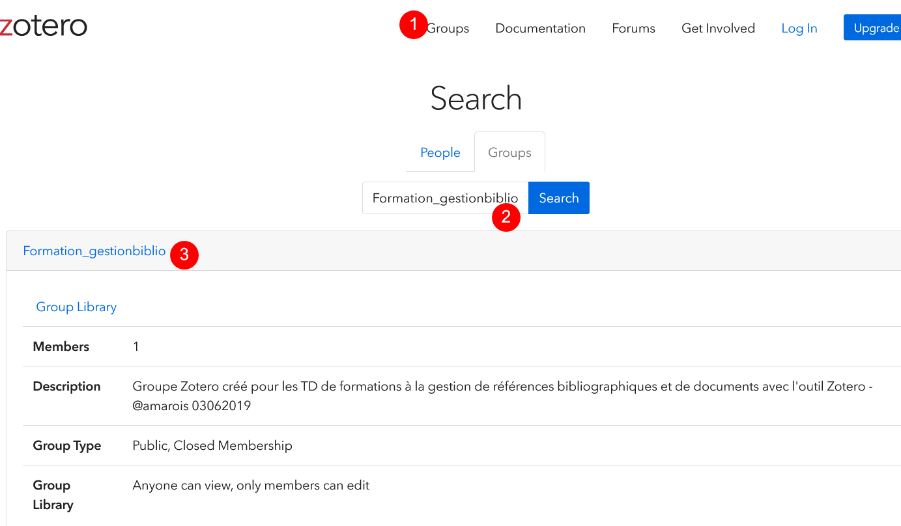
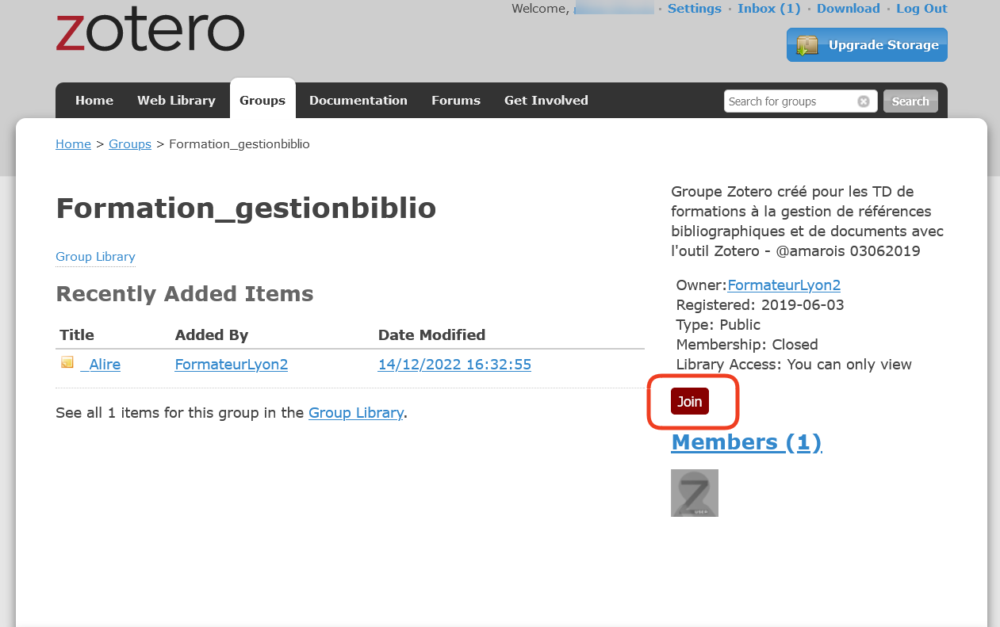

# Formation Zotero - Master SIB - décembre 2022

```
*Mise à jour** : 13 décmebre 2022
**Version** : V1
```

## Installer Zotero

Installer un environnement de travail complet basé sur Zotero consiste à :

1. installer le *logiciel Zotero* (.exe sous windows, .dmg sous MacOS; linux est également supporté) sur son poste informatique
2. installer un second élément, le « Zotero connector », qui est une *extension de votre navigateur web* qui va faciliter la collecte de références
3. vérifier qu’un 3e élément, le *plugin* Zotero pour traitement de texte, s’est installé automatiquement dans votre traitement de texte préféré (Word, LibreOffice)


Dans un second temps, il est recommandé (car très utile) de se créer un compte sur le site zotero.org, mais *cela n'est pas indispensable* à l'utilisation du logiciel Zotero. Sachez cependant que créer un compte sur Zotero.org permettra : 

1. une synchronisation de vos références entre plusieurs Zotero si vous utilisez plusieurs postes de travail
2. un travail collaboratif autour des références bibliographiques au sein de groupes
3. un premier niveau de sauvegarde de vos données

Pour créer un compte Zotero : https://www.zotero.org/user/register/ (en cas de login-password oublié : https://www.zotero.org/user/lostpassword)

## Avant la séance en présentiel : 
Nous vous demandons de *procéder à l'installation du logiciel Zotero et du Connector* (l'extension dédiée pour navigateur), afin de gagner du temps.

**Pour télécharger le logiciel** : 

1. se rendre sur le site Zotero.org : https://www.zotero.org/download/
2. cliquer sur  "Zotero 6 for" (...Windows ou ...MacOS, selon votre système) pour télécharger l'exécutable
3. lancer l'exécutable .exe ou .dmg une fois téléchargé et installer l'application en suivant l’assistant d'installation

Dans la foulée, et si vous optez pour ouvrir Zotero juste après l'installation (comportement par défaut), le logiciel lancera votre navigateur web par défaut (donc pas nécessairement celui que vous utilisez couramment) et ouvrira la page dédiée au téléchargement de l'extension (Zotero Connector) à l'adresse https://www.zotero.org/download/connectors, donc : 

- si vous êtes sur votre navigateur favoris (parmi : Safari, Edge, Firefox, Chrome), très bien : installez l'extension proposée en cliquant sur "Install" et en acceptant l'installation de l'extension dans votre navigateur
- si vous préférez utiliser un autre navigateur, fermez le navigateur ouvert par défaut qui ne vous convient pas, puis ouvrez votre navigateur favori et retournez sur https://www.zotero.org/download/connectors (ou https://www.zotero.org/download/ partie droite "Zotero Connector" sur la page web).

**Note 1** : vous pouvez installer l'extension Zotero Connector sur plusieurs navigateurs différents si vous voulez, cela ne créera pas pour autant de problème (pas de risque de conflit).

**Note 2** : le logiciel Zotero sera dans la langue par défaut de votre système d’exploitation, mais nous pourrons changer cette langue si cela vous est utile.

**Note 3** : nous vérifierons ensemble et testerons lors de la séance le plugin de votre traitement de texte.

## TD (Matin)
### Collecter des références
#### Via le connecteur
Consigne : [utilisez l'extension Zotero](https://www.zotero.org/support/adding_items_to_zotero#via_your_web_browser) (*connector*) de votre navigateur pour collecter les références des ressources pointées ci-dessous :

1. [https://www.cairn.info/revue-i2d-information-donnees-et-documents-2022-1-page-8.htm](https://www.cairn.info/revue-i2d-information-donnees-et-documents-2022-1-page-8.htm)
2. [https://books.openedition.org/oep/14732](https://books.openedition.org/oep/14732)
3. [https://www.theses.fr/2021HESAC031](https://www.theses.fr/2021HESAC031)
4. https://www.sudoc.fr/257245073
5. [https://dumas.ccsd.cnrs.fr/dumas-03878231](https://dumas.ccsd.cnrs.fr/dumas-03878231)

Bonus : importez les 10 premières références sur la page de résultats Google Scholar pointée par ce lien **en 3 clics seulement**

- https://scholar.google.fr/scholar?as_ylo=2022&q=deepfakes+AND+%C3%A9ducation+num%C3%A9rique&hl=fr&as_sdt=0,5&as_vis=1

([indice](https://www.zotero.org/support/adding_items_to_zotero#multiple_results))

#### Via un identifiant
Consigne : utilisez la fonction d'import à partir d'un identifiant pour récupérer les métadonnées des ressources correspondantes :

- un ISBN : **979-10-97088-37-8**
- un DOI : **10.1038/508312a**

([indice](https://www.zotero.org/support/adding_items_to_zotero#add_item_by_identifier))

**Note** : "Le _Digital Object Identifier_ (DOI, littéralement « identifiant d’objet numérique ») est le cœur d’un mécanisme d’identification de ressources numériques, comme les revues, articles scientifiques, livres numériques, chapitres de livres, figures, etc. Il est parfois comparé aux ISSN ou ISBN pour le web, mais c’est aussi une alternative à l’instabilité des URL par l’association de la localisation du document et des métadonnées qui lui sont liées." (https://objs-fr.hypotheses.org/367)

**Bonus** : importez la référence suivante : **10.1109/SHUSER.2012.6268849** . Que remarquez-vous ?

#### Récupération via des PDF
Consigne 1 :  pointez le lien ci-dessous, télécharger le fichier **pdf_to_zotero.zip**, décompressez le sur votre disque dur,  glissez-déposez les pdf dans votre Zotero

- [https://bul.univ-lyon2.fr/index.php/s/58D8G8rW4VLBq0L](https://bul.univ-lyon2.fr/index.php/s/58D8G8rW4VLBq0L)

Consigne 2 : tentez de glisser-déposer un ou des PDF présents sur votre disque dur depuis votre explorateur de fichiers vers Zotero. Le résultat variera selon l'origine des fichiers choisis; examinez le résultat.

#### Via un import de fichier de références structuré
**Cas d'école** : on vous *partage* une bibliographie complète dans [un format "Zotero compatible"](https://www.zotero.org/support/kb/importing_standardized_formats) ! Téléchargez le fichier compressé suivant - à décompresser sur votre poste - puis utilisez la fonction d'**import** de Zotero pour récupérer l'ensemble des références et fichiers joints

- [https://bul.univ-lyon2.fr/index.php/s/c6wQgyBe2zlnLGW](https://bul.univ-lyon2.fr/index.php/s/c6wQgyBe2zlnLGW)

(indice : Fichier > Importer... ; pour l'import, choisissez le fichier "Documents exportés.rdf"; dans le processus, **gardez bien cochée** l'option "Placer les collections et les documents importés dans une nouvelle collection")


### Organiser sa bibliothèque
Vous voilà avec tout un tas de références hétéroclites. Organisez un peu tout cela.

Dans votre bibliothèque Zotero :

1. **[Créez une Collection](https://www.zotero.org/support/collections_and_tags#creating_collections)** nommée "OSINT".
2. Revenez au niveau de Ma bibliothèque pour afficher toutes les références. **Triez** les références par la colonne Type de documents. **Sélectionnez** toutes celles traitant d'OSINT (Ctrl+clic ou Shift+clic).
3. **[Glissez-déposez](https://www.zotero.org/support/collections_and_tags#adding_items_to_collections)** les références dans la collection "OSINT".
4. Suite à l'import précédent, vous devriez avoir une collection "Documents exportés". **Renommez**-la en "Tutos Zotero".
5. **Créez un marqueur "A_Lire"**. Ajoutez-le à quelques références. Dans le panneau des marqueurs, attribuez-lui une couleur. Ouvrez la recherche avancée. Cherchez le marqueur "A_Lire". Enregistrez la recherche : toutes vos références à lire doivent s'y retrouver automatiquement.

Astuce : il est vivement conseillé de désactiver l'import automatique de marqueurs avec les références en décochant la case correspondante dans Préférences > Générales. Ainsi vous utiliserez plus efficacement cette fonctionnalité avec vos marqueurs personnels.

Voir notamment : [Collections and Tags](https://www.zotero.org/support/collections_and_tags "collections_and_tags") | [Searching](https://www.zotero.org/support/searching "searching")

### Notes et PDF

1. Importez dans Zotero  Wilkinson Mark D., Dumontier Michel, Aalbersberg IJsbrand Jan et al., « The FAIR Guiding Principles for scientific data management and stewardship », _Scientific Data_ 3, 15.03.2016. En ligne: <https://doi.org/10.1038/sdata.2016.18>, consulté le 12.12.2017.
2. Ouvrez le PDF dans le lecteur Zotero
3. Page 1, sélectionnez et surlignez en rouge le passage où les auteurs exposent leur vision de ce à quoi doit s'appliquer les principes FAIRs (_"Importantly, it is our intent that the principles apply not only to ‘data’ in the conventional sense,..."_)
4. Page 2, repérez le passage où il est question du potentiel computationnel des données de recherche (_"Humans, however, are not the only critical stakeholders in the milieu of scientific data...."_) et ajoutez une note à ce niveau.
5. Page 4,  encadrez la _Box 2 : The FAIR guiding principles_, et ajoutez une commentaire dans le panneau de gauche sous la note signalant que dès F2 il est question de R1 et de l'importance des métadonnées;  R1.3.
6. Ajoutez un marqueur à cette image encadrée

### Les styles bibliographiques : ajouter un style, utiliser un style, changer de style bibliographique
#### Utiliser des styles
Zotero s'installe avec une liste réduite de styles bibliographiques de base. Vous allez apprendre à en installer d'autres et les tester : nous allons reconstituer une bibliographie sous word à partir de son modèle PDF.

1. Choisissez un des documents word ci-dessous. Ouvrez-le dans votre traitement de texte.
2. Téléchargez et ouvrez le modèle PDF correspondant (...APA... ou ...VANCOUVER...)
3. Cherchez et intégrez les références bibliographiques nécessaires sur le web et intégrez les à votre bibliothèque Zotero.
4. A l'aide du [plugin Zotero](https://www.zotero.org/support/word_processor_plugin_usage) > **Add/Edit citation**, réalisez les appels de citations dans le texte aux bons endroits.
5. Ajoutez "Bibliographie" après le texte et générez la bibliographie avec le plugin Zotero > **[Add/Edit Bibliography](https://www.zotero.org/support/word_processor_plugin_usage#bibliography)**.
6. BONUS :  téléchargez l'autre modèle. Modifiez le style bibliographique de votre document word pour vous conformer à ce nouveau modèle. Constatez les différences. Les appels de citation et la bibliographie sont modifiés avec le nouveau style ! La forme change, le fond est conservé.

**Votre travail est de prendre soin du fond. Laissez faire la machine pour le reste.**

Style APA : 
- [zotero_citer_APA_EXERCICE.docx](zotero_citer_APA_EXERCICE.docx)
- [zotero_citer_APA_EXERCICE.docx](zotero_citer_APA_EXERCICE.docx)

Style VANCOUVER : 
- [zotero_citer_VANCOUVER_EXERCICE.doc](zotero_citer_VANCOUVER_EXERCICE.doc)
- [zotero_citer_VANCOUVER_MODELE.pdf](zotero_citer_VANCOUVER_MODELE.pdf)

#### Trouver un style et l'installer

1. Retournez dans Zotero. Allez dans Préférences > (onglet) Citer. Cliquez sur "**Obtenir plus de styles...**".
2. Dans la fenêtre "Zotero style repository" qui s'ouvre, cherchez le style **Triangle (Français)**. Cliquez sur le lien "Triangle (Français)" pour l'installer. Retournez dans l'onglet Citer, vérifiez que le style Triangle (Français) est bien présent dans le **Gestionnaire de styles**.
3. Retournez dans un des documents word d'exercice et changez le style de citation via **[Document Preferences](https://www.zotero.org/support/word_processor_plugin_usage#document_preferences)**. Choisir Triangle (Français). 

Astuce : c'est à ce stade (l'édition d'une bibliographie mise en forme) souvent que l'on voit des coquilles (auteurs orthographiés différemment, coquilles dans les titres, "p." en trop, etc. ). Prenez l'habitude dans ce cas d'aller corriger _à la source, dans votre bibliothèque Zotero_ les erreurs, puis cliquez dans votre document sur Refresh au niveau du plugin Zotero. Ainsi, vous **capitalisez votre travail** de relecture en prenant soin de votre base de références.

Remarque : un stratégie pour trouver un style précis peut être de partir d'une bibliographie déjà formatée, à laquelle on voudrait "coller", par exemple sur un PDF d'éditeur, et utiliser l'outil "[Search by example](https://editor.citationstyles.org/searchByExample/)". 

### Prenez soin de vos références...!
Votre bibliothèque Zotero commence a être bien remplie. Certaines références méritent sans doute d'être complétées, modifiées.

Prenez l'habitude, régulièrement de nettoyer votre vos références : 

- les métadonnées bibliographiques :
    - les types de documents sont-ils les bons ?
    - existe-t-il des doublons ?
    - la casse des titres, etc. est-elle la bonne ?
    - les auteurs, titre de publications, éditeurs, sont-ils homogènes ?
    - tous les chapitres, articles, ont-ils une pagination ?
    - etc.
- les marqueurs : 
    - avez-vous des marqueurs en trop (ceux importés automatiquement ? doublons dû à des coquilles ? homonymes ?)
    - toutes vos références ont-elles des marqueurs ?
    - vos marqueurs d'action sont-ils à jour ?
    - etc.
- les pièces jointes : 
    - avez-vous des pièces jointes en trop ? Ou manque-t-il des pièces jointes ?
    - vos fichiers sont-ils correctement nommés ?
    - tous les liens vers des pièces jointes, ou des URL, fonctionnent-ils encore ?

**Important** : le connecteur Zotero importe...ce qu'il trouve. Il ne fait aucun contrôle. C'est à vous de les faire. Faites-les le plus systématiquement possible, sinon votre bibliothèque de références deviendra vite ingérable. Assez rapidement vous trouverez quelles bases de données, catalogues de bibliothèques, etc. privilégier pour tel ou tel type de référence, ce qui limitera les retouches à faire.

**Pour aller plus loin** : Daniel Johanna, « Ranger Zotero, un chantier idéal pour chercheur confiné ! (1) », Isidore & Ganesh, 17 avril 2020, consulté le 17 avril 2020, URL :  https://ig.hypotheses.org/2180.
Daniel Johanna, « Ranger Zotero, un chantier idéal pour chercheur confiné ! (2) », Isidore & Ganesh, consulté le 20 janvier 2021, URL :  https://ig.hypotheses.org/2299.

## TD (après-midi)
###  Les plugins Zotero : installez, testez
Repartissez vous en 4 ou 5 groupes, choisissez un plugin parmi la liste suivante; installez le, testez le (ou parcourez rapidement la doc.) et préparer un retour très rapide pour l'ensemble de la classe : à quoi sert-il ? cas d'usages possibles ? limites ? 

- Zutilo
- Zotero PDF Translate
- ZotFile
- Better BibTeX
- zotero-scihub
- zotero-open-citations

Page dédiée au plugin sur le doc. Zotero : [https://www.zotero.org/support/plugins](https://www.zotero.org/support/plugins)


###  Collaborez au sein d'un groupe Zotero

Consigne : expérimentez la collaboration au sein d'un groupe Zotero en demandant à faire partie du groupe suivant

1. Connectez-vous sur [zotero.org/user/login](https://www.zotero.org/user/login/)https://www.zotero.org/user/login/
2. Trouvez le groupe "Formation_gestionbiblio" via la recherche sur zotero.org
3. Demandez à intégrer le groupe en cliquant sur "join"

Sujet (proposition pour le 15/12/2022) : **"Veille sur ChatGPT : technologie, applications, impact sociétaux"**





